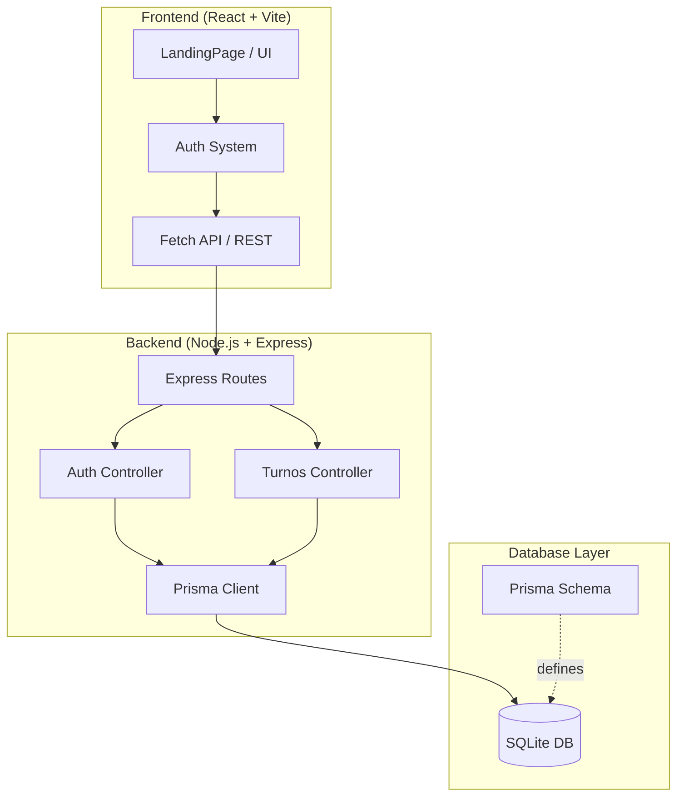
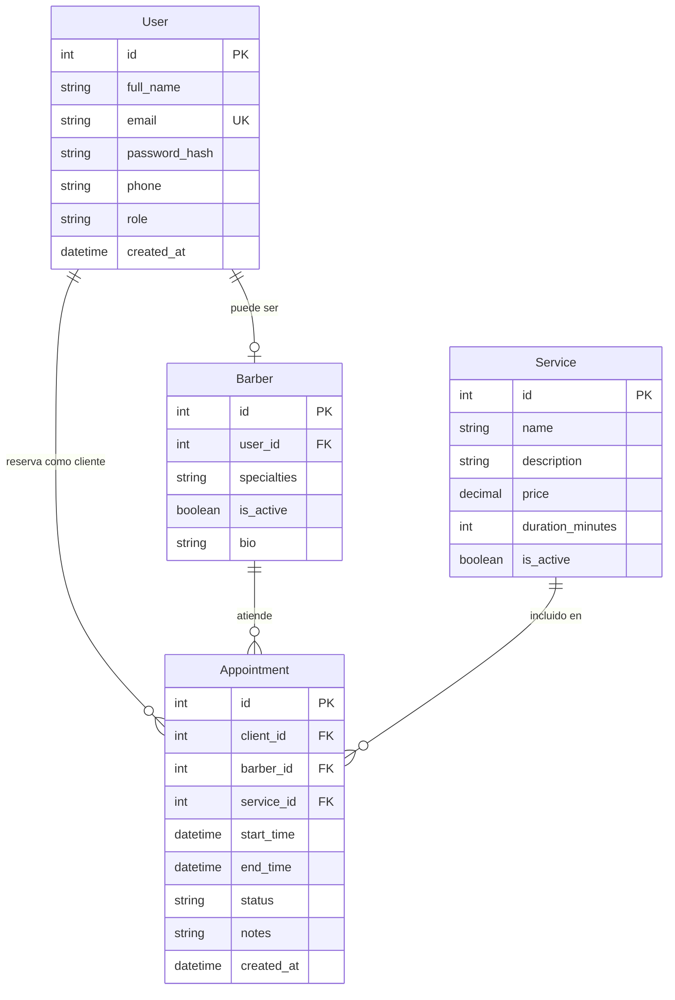

# 💈 ROYAL BARBER SYSTEM - INDUSTRIAL PREMIUM
> **Precisión Táctica en cada corte. Arquitectura optimizada para la excelencia.**

Bienvenido al sistema de gestión de barbería de alta gama. Este proyecto combina un diseño industrial de vanguardia con una arquitectura robusta y ligera, optimizada para funcionar con la máxima fluidez.

> [!TIP]
> Puedes ver el plan detallado de desarrollo en la [**Hoja de Ruta del Sistema (ROADMAP_SYSTEM.md)**](file:///d:/Documentos/Works_On_My_Machine/Sistema_de_turnos_Barberia/ROADMAP_SYSTEM.md).

---

## 🏗️ Arquitectura del Software

El sistema utiliza una arquitectura **moderna full-stack** con **Prisma ORM** para gestión de base de datos type-safe, **SQLite** para máxima velocidad local y **React + Vite** para una UI ultrarrápida.



### 🔷 Stack Tecnológico
- **Frontend**: React 18 + Vite + TailwindCSS
- **Backend**: Node.js + Express 5
- **ORM**: Prisma (Type-safe database access)
- **Database**: SQLite (Portable, zero-config)
- **Auth**: Bcrypt.js (Password hashing)

---

## 📂 Estructura Detallada de Carpetas

### 🟢 Raíz del Proyecto
- `server/`: Núcleo del Backend (Node.js/Express + Prisma).
  - `prisma/`: Configuración de Prisma ORM
    - `schema.prisma`: Definición de modelos y relaciones
  - `index.js`: Servidor Express con Prisma Client
- `client/`: Aplicación Frontend (React).
- `scripts/`: Herramientas de inicialización y carga de datos (Seeding).
- `database.sqlite`: Archivo de base de datos SQLite.
- `DATABASE_SCHEMA.sql`: Schema SQL de referencia (legacy).

### 🔵 Frontend (`/client/src`)
- `LandingBarber.jsx`: **El Corazón de la UI.** Contiene todo el diseño "Tactical Industrial", el Modal de Autenticación y las secciones de la Landing Page.
- `App.jsx`: Punto de entrada principal que orquestra los componentes.
- `index.css`: Directivas de Tailwind CSS y efectos globales (Scanlines, Glitch).
- `main.jsx`: Renderizado de React y configuración del StrictMode.

### 🟡 Backend (`/server`)
- `index.js`: Servidor Express con Prisma Client, CORS, y rutas de autenticación.
- `prisma/schema.prisma`: Schema de base de datos con modelos User, Barber, Service, Appointment.

---

## 🗄️ Base de Datos con Prisma

### Modelos Principales

#### 👤 **User** (Usuarios del sistema)
```prisma
model User {
  id            Int      @id @default(autoincrement())
  full_name     String
  email         String   @unique
  password_hash String
  phone         String?
  role          String   @default("client") // 'admin', 'client', 'barber'
  created_at    DateTime @default(now())
}
```

#### ✂️ **Barber** (Perfil de barbero)
```prisma
model Barber {
  id           Int     @id @default(autoincrement())
  user_id      Int     @unique
  specialties  String?
  is_active    Boolean @default(true)
  bio          String?
}
```

#### 💼 **Service** (Servicios ofrecidos)
```prisma
model Service {
  id               Int     @id @default(autoincrement())
  name             String
  description      String?
  price            Decimal
  duration_minutes Int
  is_active        Boolean @default(true)
}
```

#### 📅 **Appointment** (Turnos/Citas)
```prisma
model Appointment {
  id         Int      @id @default(autoincrement())
  client_id  Int
  barber_id  Int
  service_id Int
  start_time DateTime
  end_time   DateTime
  status     String   @default("pending")
  notes      String?
  created_at DateTime @default(now())
}
```

### 🔗 Relaciones
- Un **User** puede tener un perfil de **Barber** (relación 1:1)
- Un **User** puede tener múltiples **Appointments** como cliente
- Un **Barber** puede tener múltiples **Appointments**
- Un **Service** puede estar en múltiples **Appointments**

---

## 🎨 Sistema de Diseño: "SHARP & BOLD" v2.0
El software implementa un lenguaje visual **Tactical-Industrial** diseñado para impresionar:
- **Estética de Terminal**: Efectos de scanlines y tipografía HUD (Heads-Up Display).
- **Animaciones "Razor-Sharp"**: Botones con efectos de brillo tipo navaja y transiciones de alto impacto.
- **Paleta de Colores**: `Zinc-950` (Fondo), `Amber-500` (Acentos de lujo) y `White` (Tipografía limpia).

---

## 🔐 Lógica de Funcionamiento (Auth)
El sistema utiliza una autenticación segura basada en Prisma:
1. El usuario ingresa sus credenciales en el `AuthModal`.
2. El frontend realiza un `POST` a `/api/auth/login`.
3. El servidor usa **Prisma Client** para buscar el usuario por email.
4. Se verifica el hash de la contraseña con **Bcrypt** (soporta legacy plain text).
5. Se devuelve un objeto de usuario si la validación es correcta.

```javascript
// Ejemplo de consulta con Prisma
const user = await prisma.user.findUnique({
  where: { email: email }
});
```

---

## 🚀 Guía de Instalación Completa

### 1️⃣ **Instalación de Dependencias**

**Raíz del proyecto (Backend dependencies):**
```bash
npm install
```

**Frontend:**
```bash
cd client
npm install
```

### 2️⃣ **Configuración de Prisma**

**Generar el Prisma Client:**
```bash
cd server
npx prisma generate
```

**Sincronizar el schema con la base de datos:**
```bash
npx prisma db push
```

**Ver la base de datos en Prisma Studio (opcional):**
```bash
npx prisma studio
```

### 3️⃣ **Iniciar el Sistema**

**Backend (Terminal 1):**
```bash
# Desde la raíz del proyecto
npm run server
# O directamente:
node server/index.js
```
El servidor estará en: `http://localhost:3001`

**Frontend (Terminal 2):**
```bash
cd client
npm run dev
```
La aplicación estará en: `http://localhost:5173`

---

## 🛠️ Comandos Útiles de Prisma

| Comando | Descripción |
|---------|-------------|
| `npx prisma generate` | Genera el Prisma Client basado en el schema |
| `npx prisma db push` | Sincroniza el schema con la base de datos |
| `npx prisma studio` | Abre interfaz visual para ver/editar datos |
| `npx prisma migrate dev` | Crea una nueva migración (para producción) |
| `npx prisma db seed` | Ejecuta el script de seeding |
| `npx prisma format` | Formatea el archivo schema.prisma |

---

## 🔑 Credenciales de Prueba

### Modo Admin
- **Email**: `admin@barber.com`
- **Password**: `admin123`

> [!NOTE]
> Puedes crear más usuarios usando Prisma Studio o los scripts de seeding.

---

## 🗺️ Capacidades del Sistema

### ✅ Implementado
- [x] Landing Page Industrial Premium
- [x] Sistema de Autenticación con Prisma
- [x] Base de Datos SQLite + Prisma ORM
- [x] Diseño adaptativo (Mobile / Desktop)
- [x] Schema de base de datos completo (Users, Barbers, Services, Appointments)

### 🚧 En Desarrollo
- [ ] Módulo de Agenda Táctica
- [ ] CRUD de Turnos/Appointments
- [ ] Panel de Administración
- [ ] Gestión de Barberos y Servicios
- [ ] Dashboard con métricas en tiempo real
- [ ] Notificaciones Push/WhatsApp

---

## 📊 Estructura de la Base de Datos



---

## 🐛 Troubleshooting

### Error: "Cannot find module '@prisma/client'"
**Solución:**
```bash
cd server
npx prisma generate
```

### Error: "Database does not exist"
**Solución:**
```bash
cd server
npx prisma db push
```

### El servidor no inicia
**Verificar:**
1. Puerto 3001 disponible
2. Prisma Client generado
3. Base de datos sincronizada

### El frontend no se conecta al backend
**Verificar:**
1. CORS habilitado en `server/index.js`
2. URL correcta en las llamadas fetch del frontend
3. Servidor corriendo en puerto 3001

---

## 📝 Próximos Pasos

1. **Implementar Dashboard** (Ver [ROADMAP_SYSTEM.md](file:///d:/Documentos/Works_On_My_Machine/Sistema_de_turnos_Barberia/ROADMAP_SYSTEM.md))
2. **Crear CRUD de Appointments** con Prisma
3. **Agregar gestión de Barberos y Servicios**
4. **Implementar sistema de notificaciones**

---

**Royal Barber System © 2025** | *Diseñado para los que no aceptan menos que la perfección.*

> Powered by **Prisma ORM** 🚀 | Built with **React + Vite** ⚡ | Styled with **TailwindCSS** 🎨